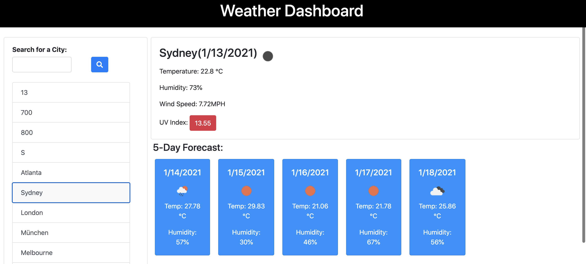

# A Weather Dashboard

## Description 
What? 
A project that launches a Weather Dashboard for Sydney by making use of APIs from OpenWeather.

Why? 
To enable the user to see the current weather for Sydney and the weather forecast for the next 5 days, in order to plan his/her day better.

How? Using JavaScript (including Moments.js, jQuery), HTML, CSS and APIs from OpenWeather.

## Link to Deployed Application

https://aksco.github.io/weather-dashboard/

## Usage

Run the index file ensuring that it opens in Google Chrome for optimal results.

## Copyright

© 2020 Trilogy Education Services, LLC, a 2U, Inc. brand. Confidential and Proprietary. All Rights Reserved.
